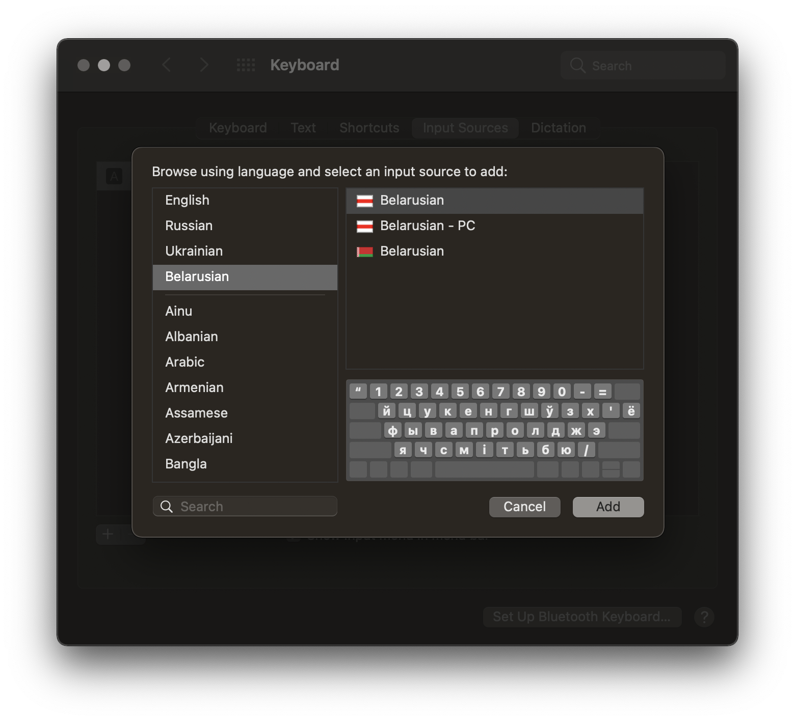

[Спампаваць/Download](./Belarusian.dmg?raw=true)

# Што гэта?
Дэфолтная беларуская раскладка macOS, але з БЧБ сцягам, беларуская PC раскладка

# Як паставіць?
- Адкрыць *Belarusian.dmg*, клікнуць на *Belarusian.bundle*, паставіць раскладку
- Logout/Reboot у выпадку, калі абнаўляецеся з папярэдняй версіі
- Стандартным шляхам абраць новую клавіятуру ў *System Preferences/Keyboard/Input Sources* (там жа, дзе звычайная беларуская мова з ЧЗ)

